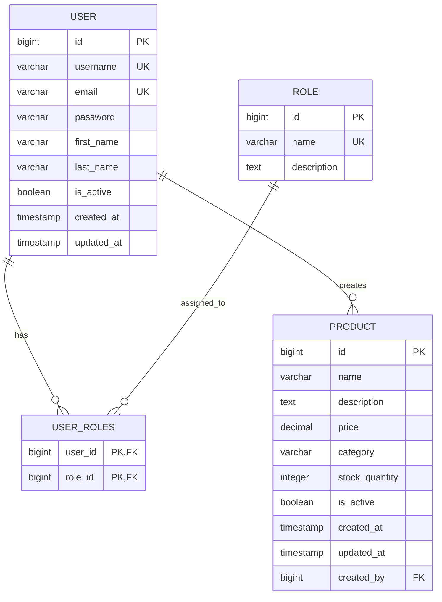

# Spring Boot JWT Backend

A comprehensive Spring Boot 3.1 backend application with JWT authentication, PostgreSQL database, and production-ready features.

## 🚀 Features

- **JWT Authentication & Authorization** with RSA256 signing
- **RESTful APIs** with comprehensive CRUD operations
- **PostgreSQL Database** with Flyway migrations
- **Spring Security** with role-based access control
- **HTTPS/SSL Support** with configurable certificates
- **CORS Configuration** for cross-origin requests
- **Docker & Docker Compose** for containerization
- **GitHub Actions CI/CD** pipeline
- **Custom JPA Queries** with both JPQL and native SQL
- **Global Exception Handling** with detailed error responses
- **Comprehensive Logging** with configurable levels
- **Health Checks & Monitoring** with Spring Actuator

## 🛠️ Technology Stack

- **Java 21** with preview features enabled
- **Spring Boot 3.1.5** with latest dependencies
- **Spring Security 6** for authentication & authorization
- **PostgreSQL 15** as the primary database
- **JWT (JSON Web Tokens)** for stateless authentication
- **Flyway** for database migrations
- **Docker & Docker Compose** for containerization
- **Maven** for build automation
- **JUnit 5 & Testcontainers** for testing

## 📋 Prerequisites

- Java 21 or higher
- Maven 3.6+
- Docker & Docker Compose
- PostgreSQL 15+ (if running without Docker)

## 🏃‍♂️ Quick Start

### 1. Clone the Repository

```bash
git clone https://github.com/your-username/spring-boot-jwt-backend.git
cd spring-boot-jwt-backend
```

### 2. Generate SSL Certificate (Optional)

```bash
chmod +x generate-ssl.sh
./generate-ssl.sh
```

### 3. Run with Docker Compose

```bash
# Start all services (PostgreSQL + Spring Boot)
docker-compose up -d

# View logs
docker-compose logs -f backend

# Stop services
docker-compose down
```

### 4. Run Locally in IntelliJ

1. Start PostgreSQL database:
   ```bash
   docker-compose up postgres -d
   ```

2. Open the project in IntelliJ IDEA

3. Set up environment variables:
   - `JWT_SECRET`: Base64 encoded secret key
   - `DATABASE_URL`: jdbc:postgresql://localhost:5432/backend_db
   - `DATABASE_USERNAME`: backend_user
   - `DATABASE_PASSWORD`: backend_password

4. Run `BackendApplication.java`

## 🔐 API Authentication

### Register a new user
```bash
curl -X POST http://localhost:8080/api/auth/register   -H "Content-Type: application/json"   -d '{
    "username": "johndoe",
    "email": "john@example.com",
    "password": "password123",
    "firstName": "John",
    "lastName": "Doe"
  }'
```

### Login
```bash
curl -X POST http://localhost:8080/api/auth/login   -H "Content-Type: application/json"   -d '{
    "username": "johndoe",
    "password": "password123"
  }'
```

### Access protected endpoints
```bash
curl -X GET http://localhost:8080/api/users/profile   -H "Authorization: Bearer YOUR_JWT_TOKEN"
```

## 📚 API Endpoints

### Authentication
- `POST /api/auth/register` - Register new user
- `POST /api/auth/login` - User login
- `POST /api/auth/refresh` - Refresh JWT token
- `POST /api/auth/logout` - User logout

### Users (Protected)
- `GET /api/users` - Get all users (Admin only)
- `GET /api/users/profile` - Get current user profile
- `GET /api/users/{id}` - Get user by ID
- `PUT /api/users/{id}` - Update user
- `PATCH /api/users/{id}/activate` - Activate user (Admin only)

### Products (Protected)
- `GET /api/products` - Get all products
- `GET /api/products/{id}` - Get product by ID
- `POST /api/products` - Create product (Authenticated users)
- `PUT /api/products/{id}` - Update product (Owner/Admin)
- `DELETE /api/products/{id}` - Delete product (Owner/Admin)

## 🗄️ Database Schema (MCD)



## 🐳 Docker Configuration

### Environment Variables

| Variable | Description | Default |
|----------|-------------|---------|
| `SPRING_PROFILES_ACTIVE` | Active Spring profile | `dev` |
| `JWT_SECRET` | Base64 encoded JWT secret | Generated |
| `DATABASE_URL` | PostgreSQL connection URL | - |
| `DATABASE_USERNAME` | Database username | `backend_user` |
| `DATABASE_PASSWORD` | Database password | `backend_password` |
| `SERVER_PORT` | Application port | `8080` |
| `SSL_ENABLED` | Enable HTTPS | `false` |

### Docker Commands

```bash
# Build custom image
docker build -t spring-boot-backend .

# Run with custom network
docker network create backend-net
docker run --network backend-net -p 8080:8080 spring-boot-backend

# View container logs
docker logs -f container-name

# Execute into container
docker exec -it container-name /bin/bash
```

## 🔧 Configuration

### HTTPS/SSL Configuration

Enable HTTPS by updating `application-prod.yml`:

```yaml
server:
  ssl:
    enabled: true
    key-store: classpath:ssl/keystore.p12
    key-store-password: changeit
    key-store-type: PKCS12
    key-alias: backend
```

### CORS Configuration

Configure allowed origins in `application.yml`:

```yaml
cors:
  allowed-origins: "https://yourdomain.com,https://app.yourdomain.com"
  allowed-methods: "GET,POST,PUT,DELETE,OPTIONS,PATCH"
  allowed-headers: "Authorization,Content-Type,X-Requested-With"
```

## 🚀 Deployment

### GitHub Actions CI/CD

The project includes a complete CI/CD pipeline with:

- **Automated testing** on pull requests
- **Docker image building** and publishing
- **Security scanning** with Trivy
- **Automated deployment** to production server

### Required Secrets

Set these secrets in your GitHub repository:

- `JWT_SECRET` - Base64 encoded JWT secret key
- `HOST` - Production server IP/hostname
- `USERNAME` - SSH username for deployment
- `PRIVATE_KEY` - SSH private key for deployment
- `DATABASE_URL` - Production database URL
- `DATABASE_USERNAME` - Production database username
- `DATABASE_PASSWORD` - Production database password

### Manual Deployment

```bash
# Build application
./mvnw clean package -DskipTests

# Build Docker image
docker build -t your-registry/backend:latest .

# Push to registry
docker push your-registry/backend:latest

# Deploy on server
docker-compose -f docker-compose.prod.yml up -d
```

## 🧪 Testing

### Run Tests

```bash
# Run all tests
./mvnw test

# Run specific test class
./mvnw test -Dtest=AuthControllerTest

# Run with coverage
./mvnw jacoco:prepare-agent test jacoco:report
```

### Integration Tests

The project includes integration tests using Testcontainers:

```bash
# Run integration tests with real database
./mvnw verify -P integration-tests
```

## 📊 Monitoring & Health Checks

### Health Check Endpoints

- `GET /api/actuator/health` - Application health status
- `GET /api/actuator/info` - Application information
- `GET /api/actuator/metrics` - Application metrics

### Logging Configuration

Logs are structured and can be configured per environment:

```yaml
logging:
  level:
    com.example.backend: DEBUG
    org.springframework.security: INFO
  pattern:
    console: "%d{yyyy-MM-dd HH:mm:ss} [%thread] %-5level %logger{36} - %msg%n"
```

## 🔒 Security Best Practices

- JWT tokens are signed with RSA256 algorithm
- Passwords are encrypted using BCrypt with strength 12
- CORS is configured to allow specific origins only
- SQL injection prevention through parameterized queries
- Input validation on all endpoints
- Rate limiting can be implemented using Spring Security

## 🤝 Contributing

1. Fork the repository
2. Create a feature branch (`git checkout -b feature/amazing-feature`)
3. Commit your changes (`git commit -m 'Add amazing feature'`)
4. Push to the branch (`git push origin feature/amazing-feature`)
5. Open a Pull Request

## 📝 License

This project is licensed under the MIT License - see the [LICENSE](LICENSE) file for details.

## 🆘 Troubleshooting

### Common Issues

1. **JWT Secret Key Error**
   - Ensure JWT_SECRET is properly set and base64 encoded
   - Check application logs for key generation messages

2. **Database Connection Issues**
   - Verify PostgreSQL is running and accessible
   - Check database credentials in environment variables

3. **Docker Compose Issues**
   - Ensure ports 5432 and 8080 are not in use
   - Check Docker daemon is running

4. **SSL Certificate Issues**
   - Run `./generate-ssl.sh` to create development certificates
   - For production, use certificates from a trusted CA

### Support

For issues and questions:
- Create an issue in the GitHub repository
- Check existing issues for similar problems
- Review application logs for detailed error messages
